<a href="README.pt-BR.md">Português</a>

# Hi, I'm Fabiano

I build **multi-agent workflows for Claude Code**, and work on fleet tracking and telemetry by day. Based in Brazil.

- 🤖 Running several coding agents in parallel without losing control: one tmux session and one git worktree per task, deterministic gates, and a pull request at the end.
- 📱 Steering all of it from my phone, with alerts only when an agent actually needs me.
- 🛰️ Backend APIs and live dashboards for things that move.

## How I ship

<picture>
  <source media="(prefers-color-scheme: dark)" srcset="docs/assets/how-i-ship-dark.svg">
  
</picture>

The waiter/kitchen workflow is open source: see [claude-code-kitchen](https://github.com/FabianoArthur/claude-code-kitchen).

## Featured projects

| Project | What it is |
|---|---|
| [**claude-code-kitchen**](https://github.com/FabianoArthur/claude-code-kitchen) | Waiter/kitchen multi-agent orchestration for Claude Code: one tmux session per task, isolated git worktrees, deterministic gates, until the PR is open. |
| [**claude-code-discord-hq**](https://github.com/FabianoArthur/claude-code-discord-hq) | Run Claude Code from your phone: a Discord server as code, a mobile control room, and "only ping me when you need me" alerts. |
| [**Agent control room**](https://github.com/FabianoArthur/Calculadora) | A live dashboard of coding agents working in parallel, driven by a deterministic, seeded simulation. React + TypeScript. |
| [**Algorithm visualizer**](https://github.com/FabianoArthur/atividades-2) | Sorting and pathfinding algorithms animated step by step on an editable grid. |
| [**Canvas arcade**](https://github.com/FabianoArthur/atividades3) | Classic mini-games in HTML canvas at 60 fps, with keyboard and touch controls. |
| [**Regex playground**](https://github.com/FabianoArthur/aula-1) | Test a regular expression and read a plain-language explanation of every part of it. |
| [**Design system**](https://github.com/FabianoArthur/teste-claude-design) | Accessible React components built on design tokens, with light and dark themes and a live docs site. |
| [**Parking API**](https://github.com/FabianoArthur/parking-control) | Java 21 + Spring Boot 3 API for parking spots, reservations and time-based pricing. |
| **Barbershop booking**: [web](https://github.com/FabianoArthur/barbearia-frontend) · [API](https://github.com/FabianoArthur/barbearia-backend) | A full-stack appointment app, TypeScript on both ends. |

## Stack

## Find me

- 🗂️ Portfolio: [github.com/FabianoArthur/portifolio](https://github.com/FabianoArthur/portifolio)
- 💼 LinkedIn: [Fabiano Arthur](https://www.linkedin.com/in/fabiano-arthur-p-c-de-oliveira-30bb39215/)
- 🐛 Found a problem in one of my repos? Open an issue there.

The diagram is a hand-built SVG animated with CSS only, generated by <a href="scripts/build_diagram.py">scripts/build_diagram.py</a>.
