<a href="README.md">English</a>

# Oi, eu sou o Fabiano

Construo **workflows multiagente para o Claude Code** e, no dia a dia, trabalho com rastreamento de frotas e telemetria. Moro no Brasil.

- 🤖 Vários agentes de código em paralelo sem perder o controle: uma sessão tmux e um git worktree por tarefa, checagens determinísticas e um pull request no fim.
- 📱 Tudo pilotado pelo celular, com alerta só quando um agente realmente precisa de mim.
- 🛰️ APIs de backend e painéis ao vivo para coisas que se movem.

## Como eu entrego

<picture>
  <source media="(prefers-color-scheme: dark)" srcset="docs/assets/how-i-ship.pt-BR-dark.svg">
  
</picture>

O fluxo garçom/cozinha é open source: veja o [claude-code-kitchen](https://github.com/FabianoArthur/claude-code-kitchen).

## Projetos em destaque

| Projeto | O que é |
|---|---|
| [**claude-code-kitchen**](https://github.com/FabianoArthur/claude-code-kitchen) | Orquestração multiagente garçom/cozinha para o Claude Code: uma sessão tmux por tarefa, git worktrees isolados, checagens determinísticas, até o PR aberto. |
| [**claude-code-discord-hq**](https://github.com/FabianoArthur/claude-code-discord-hq) | Claude Code pelo celular: servidor do Discord como código, sala de controle no celular e alertas do tipo "só me chame quando precisar". |
| [**Sala de controle de agentes**](https://github.com/FabianoArthur/Calculadora) | Painel ao vivo de agentes de código trabalhando em paralelo, movido por uma simulação determinística com seed. React + TypeScript. |
| [**Visualizador de algoritmos**](https://github.com/FabianoArthur/atividades-2) | Algoritmos de ordenação e de busca de caminhos animados passo a passo numa grade editável. |
| [**Arcade em canvas**](https://github.com/FabianoArthur/atividades3) | Minijogos clássicos em canvas HTML a 60 fps, com controles de teclado e toque. |
| [**Playground de regex**](https://github.com/FabianoArthur/aula-1) | Teste uma expressão regular e leia a explicação, em linguagem simples, de cada parte dela. |
| [**Design system**](https://github.com/FabianoArthur/teste-claude-design) | Componentes React acessíveis sobre design tokens, com temas claro e escuro e site de documentação ao vivo. |
| [**API de estacionamento**](https://github.com/FabianoArthur/parking-control) | API em Java 21 + Spring Boot 3 para vagas, reservas e tarifação por tempo. |
| **Agendamento de barbearia**: [web](https://github.com/FabianoArthur/barbearia-frontend) · [API](https://github.com/FabianoArthur/barbearia-backend) | App full-stack de agendamento, TypeScript nas duas pontas. |

## Stack

## Onde me achar

- 🗂️ Portfólio: [github.com/FabianoArthur/portifolio](https://github.com/FabianoArthur/portifolio)
- 💼 LinkedIn: [Fabiano Arthur](https://www.linkedin.com/in/fabiano-arthur-p-c-de-oliveira-30bb39215/)
- 🐛 Achou um problema em algum repo meu? Abra uma issue nele.

O diagrama é um SVG feito à mão, animado só com CSS e gerado por <a href="scripts/build_diagram.py">scripts/build_diagram.py</a>.
